### Questions
* 

### Objectives
YWBAT
* compare and contrast the various methods for SVMs
* implement SVMs using sklearn
* use model analysis to tailor SVM

### Outline
- Introduce dataset
- Go through various svm models and their use case
- Tweak SVMs to suit the problem

### What do SVMs do?
SVMs (Support Vector Machines) are machine learning models that divide data by using 'support vectors' to create decision boundaries. 

The sensitivity (or lack thereof) of your boundaries depends on you. 

Low Sensitivity boundaries are often wide
High Sensitivity boundaries are very narrow


### The 'Vector' Part of SVMs is the data. (x-values).

### When? Why?

SVMs are great to use anytime you want decisions to be made by using boundaries.  One example is finding points that are closest to the boundary and then using those points in your training set.  Boundaries are very helpful for classification, but also helpful for finding training points. 

Build a model
- classify new points and evaluate our classification
- if points weren't classified correctly we took their distance from the mislabeled class boundary 
- add those points to our training set


```python
import pandas as pd
import numpy as np

from sklearn.datasets import make_circles,  make_blobs, make_moons
from sklearn.svm import SVC, LinearSVC, NuSVC
from sklearn.metrics import confusion_matrix, precision_recall_fscore_support, accuracy_score, classification_report
from sklearn.model_selection import train_test_split
from mlxtend.plotting import plot_decision_regions

import matplotlib.pyplot as plt
import seaborn as sns
```


```python
def plot_groups(x, y):
    plt.figure(figsize=(8, 8))
    plt.grid(linestyle='dashed')
    color_dict = {0: 'g', 1: 'purple'}
    colors = ['g' if l == 0 else 'purple' for l in y]
    plt.scatter(x[:, 0], x[:, 1], c=colors, s=60, alpha=0.5)
    plt.xlabel("X1")
    plt.ylabel("X2")
    plt.show()
    

def plot_groups3(x, y):
    plt.figure(figsize=(8, 8))
    plt.grid(linestyle='dashed')
    color_dict = {0: 'g', 1: 'purple', 2: 'yellow'}
    colors = [color_dict[l] for l in y]
    plt.scatter(x[:, 0], x[:, 1], c=colors, alpha=0.5, s=60)
    plt.xlabel("X1")
    plt.ylabel("X2")
    plt.show()
    

    
def plot_svm_groups(x, y, clf):
    plt.figure(figsize=(8, 5))
    plt.grid()
    plot_decision_regions(x, y, clf, colors='green,purple,yellow', scatter_kwargs={"s": 100, "alpha": 0.5})
    plt.xlabel("X1")
    plt.ylabel("X2")
    plt.title("SVM Decision Boundary")
    plt.show()
    

def print_report(ytrain, ytest, ytrain_pred, ytest_pred):
    report = classification_report(ytrain, ytrain_pred)
    print("Train Scores\n" + "-"*50)
    print(report)
    accuracy = accuracy_score(ytrain, ytrain_pred)
    print(f"Train Accuracy: {accuracy}")
    report = classification_report(ytest, ytest_pred)
    print("Test Scores\n" + "-"*50)
    print(report)
    accuracy = accuracy_score(ytest, ytest_pred)
    print(f"Test Accuracy: {accuracy}")
```

## Linear SVM


```python
x, y = make_blobs(n_samples=500, n_features=2, centers=2, cluster_std=4.5)
```


```python
plot_groups(x, y)
```


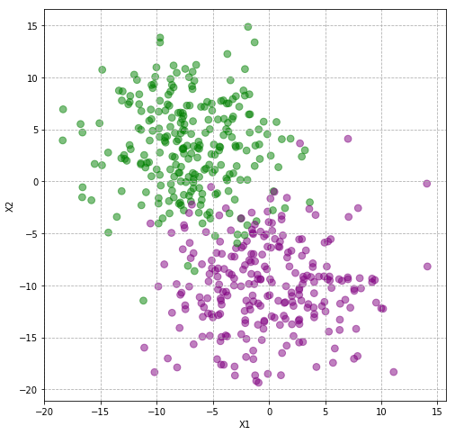


```python
xtrain, xtest, ytrain, ytest = train_test_split(x, y)
```

# SVMs are a family of models
* kernels
    * linear kernel
    * sigmoid kernel
    * polynomial kernel
    * rbf (radial basis function)
        * maps data into higher dimension


```python
clf = LinearSVC()
clf.fit(xtrain, ytrain)
```

    /Users/rafael/anaconda3/envs/flatiron-env/lib/python3.6/site-packages/sklearn/svm/_base.py:947: ConvergenceWarning: Liblinear failed to converge, increase the number of iterations.
      "the number of iterations.", ConvergenceWarning)


    LinearSVC(C=1.0, class_weight=None, dual=True, fit_intercept=True,
              intercept_scaling=1, loss='squared_hinge', max_iter=1000,
              multi_class='ovr', penalty='l2', random_state=None, tol=0.0001,
              verbose=0)


```python
plot_svm_groups(x, y, clf)
```


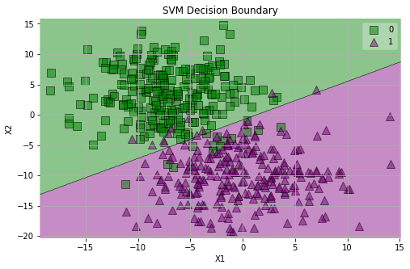


```python
clf = LinearSVC()
clf.fit(xtrain, ytrain)
ytrain_pred = clf.predict(xtrain)
ytest_pred = clf.predict(xtest)
plot_svm_groups(x, y, clf)
print_report(ytrain, ytest, ytrain_pred, ytest_pred)
```

    /Users/rafael/anaconda3/envs/flatiron-env/lib/python3.6/site-packages/sklearn/svm/_base.py:947: ConvergenceWarning: Liblinear failed to converge, increase the number of iterations.
      "the number of iterations.", ConvergenceWarning)


    Train Scores
    --------------------------------------------------
                  precision    recall  f1-score   support
    
               0       0.95      0.95      0.95       185
               1       0.95      0.95      0.95       190
    
        accuracy                           0.95       375
       macro avg       0.95      0.95      0.95       375
    weighted avg       0.95      0.95      0.95       375
    
    Train Accuracy: 0.9493333333333334
    Test Scores
    --------------------------------------------------
                  precision    recall  f1-score   support
    
               0       0.97      0.94      0.95        65
               1       0.94      0.97      0.95        60
    
        accuracy                           0.95       125
       macro avg       0.95      0.95      0.95       125
    weighted avg       0.95      0.95      0.95       125
    
    Test Accuracy: 0.952


```python
clf = SVC(kernel='sigmoid')
clf.fit(xtrain, ytrain)
ytrain_pred = clf.predict(xtrain)
ytest_pred = clf.predict(xtest)
plot_svm_groups(x, y, clf)
print_report(ytrain, ytest, ytrain_pred, ytest_pred)
```


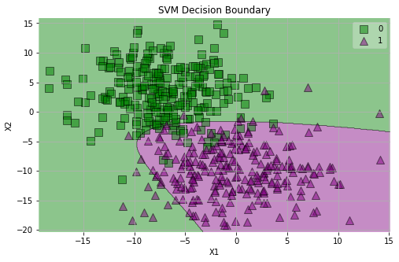


    Train Scores
    --------------------------------------------------
                  precision    recall  f1-score   support
    
               0       0.92      0.92      0.92       185
               1       0.92      0.93      0.92       190
    
        accuracy                           0.92       375
       macro avg       0.92      0.92      0.92       375
    weighted avg       0.92      0.92      0.92       375
    
    Train Accuracy: 0.9226666666666666
    Test Scores
    --------------------------------------------------
                  precision    recall  f1-score   support
    
               0       0.92      0.91      0.91        65
               1       0.90      0.92      0.91        60
    
        accuracy                           0.91       125
       macro avg       0.91      0.91      0.91       125
    weighted avg       0.91      0.91      0.91       125
    
    Test Accuracy: 0.912


```python
clf = SVC(kernel='poly')
clf.fit(xtrain, ytrain)
ytrain_pred = clf.predict(xtrain)
ytest_pred = clf.predict(xtest)
plot_svm_groups(x, y, clf)
print_report(ytrain, ytest, ytrain_pred, ytest_pred)
```


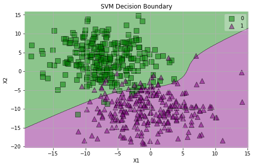


    Train Scores
    --------------------------------------------------
                  precision    recall  f1-score   support
    
               0       0.89      0.98      0.93       185
               1       0.98      0.88      0.93       190
    
        accuracy                           0.93       375
       macro avg       0.93      0.93      0.93       375
    weighted avg       0.93      0.93      0.93       375
    
    Train Accuracy: 0.928
    Test Scores
    --------------------------------------------------
                  precision    recall  f1-score   support
    
               0       0.94      0.97      0.95        65
               1       0.97      0.93      0.95        60
    
        accuracy                           0.95       125
       macro avg       0.95      0.95      0.95       125
    weighted avg       0.95      0.95      0.95       125
    
    Test Accuracy: 0.952


### let's look at RBF (Radial Basis Function)
- most popular svm 
- project your data into a higher dimension and separate it there


```python
clf = SVC(kernel='rbf')
clf.fit(xtrain, ytrain)
ytrain_pred = clf.predict(xtrain)
ytest_pred = clf.predict(xtest)
plot_svm_groups(x, y, clf)
print_report(ytrain, ytest, ytrain_pred, ytest_pred)
```


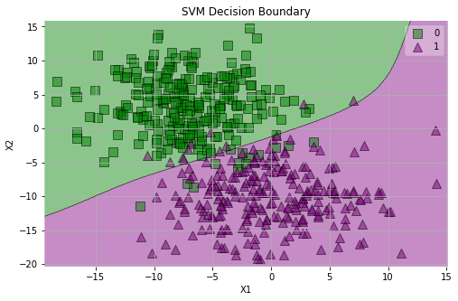


    Train Scores
    --------------------------------------------------
                  precision    recall  f1-score   support
    
               0       0.95      0.95      0.95       185
               1       0.95      0.95      0.95       190
    
        accuracy                           0.95       375
       macro avg       0.95      0.95      0.95       375
    weighted avg       0.95      0.95      0.95       375
    
    Train Accuracy: 0.9493333333333334
    Test Scores
    --------------------------------------------------
                  precision    recall  f1-score   support
    
               0       0.97      0.95      0.96        65
               1       0.95      0.97      0.96        60
    
        accuracy                           0.96       125
       macro avg       0.96      0.96      0.96       125
    weighted avg       0.96      0.96      0.96       125
    
    Test Accuracy: 0.96


```python
ytrain_pred = clf.predict(xtrain)
ytest_pred = clf.predict(xtest)
```


```python
print_report(ytrain, ytest, ytrain_pred, ytest_pred)
```

    Train Scores
    --------------------------------------------------
                  precision    recall  f1-score   support
    
               0       0.95      0.95      0.95       185
               1       0.95      0.95      0.95       190
    
        accuracy                           0.95       375
       macro avg       0.95      0.95      0.95       375
    weighted avg       0.95      0.95      0.95       375
    
    Train Accuracy: 0.9493333333333334
    Test Scores
    --------------------------------------------------
                  precision    recall  f1-score   support
    
               0       0.97      0.95      0.96        65
               1       0.95      0.97      0.96        60
    
        accuracy                           0.96       125
       macro avg       0.96      0.96      0.96       125
    weighted avg       0.96      0.96      0.96       125
    
    Test Accuracy: 0.96


```python
clf.predict(np.array([[0, 5]]))
```


    array([0])


```python
clf.decision_function(np.array([[-20, 20]]))
```


    array([-0.15603795])


### Thoughts

- Training data is probably coming from the overlaps
- Testing data is probably from the outside of each group

## RBF SVM


```python
x, y = make_circles(n_samples=2000, shuffle=True, noise=0.1)
plot_groups(x, y)
```


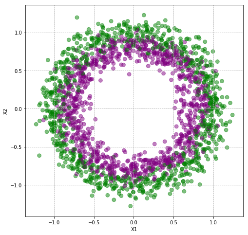


```python

```


```python
xtrain, xtest, ytrain, ytest = train_test_split(x, y)
```

### Linear SVM


```python
clf = LinearSVC()
clf.fit(xtrain, ytrain)
ytrain_pred = clf.predict(xtrain)
ytest_pred = clf.predict(xtest)
plot_svm_groups(x, y, clf)
print_report(ytrain, ytest, ytrain_pred, ytest_pred)
```


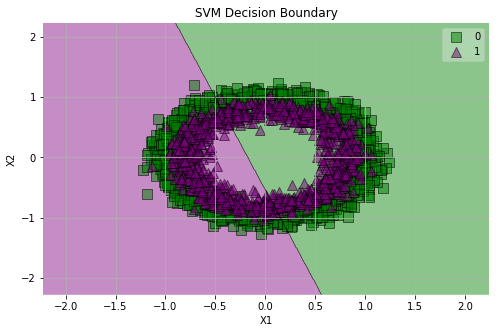


    Train Scores
    --------------------------------------------------
                  precision    recall  f1-score   support
    
               0       0.50      0.56      0.52       751
               1       0.49      0.44      0.46       749
    
        accuracy                           0.50      1500
       macro avg       0.50      0.50      0.49      1500
    weighted avg       0.50      0.50      0.49      1500
    
    Train Accuracy: 0.49533333333333335
    Test Scores
    --------------------------------------------------
                  precision    recall  f1-score   support
    
               0       0.49      0.55      0.52       249
               1       0.49      0.43      0.46       251
    
        accuracy                           0.49       500
       macro avg       0.49      0.49      0.49       500
    weighted avg       0.49      0.49      0.49       500
    
    Test Accuracy: 0.492


### RBF


```python
clf = SVC(kernel='rbf')
clf.fit(xtrain, ytrain)
ytrain_pred = clf.predict(xtrain)
ytest_pred = clf.predict(xtest)
plot_svm_groups(x, y, clf)
print_report(ytrain, ytest, ytrain_pred, ytest_pred)
```


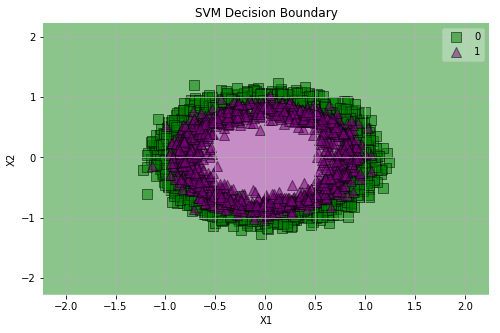


    Train Scores
    --------------------------------------------------
                  precision    recall  f1-score   support
    
               0       0.84      0.85      0.85       751
               1       0.85      0.84      0.84       749
    
        accuracy                           0.85      1500
       macro avg       0.85      0.85      0.85      1500
    weighted avg       0.85      0.85      0.85      1500
    
    Train Accuracy: 0.846
    Test Scores
    --------------------------------------------------
                  precision    recall  f1-score   support
    
               0       0.80      0.83      0.81       249
               1       0.82      0.80      0.81       251
    
        accuracy                           0.81       500
       macro avg       0.81      0.81      0.81       500
    weighted avg       0.81      0.81      0.81       500
    
    Test Accuracy: 0.812


### Thoughts
- When do use this? 
- When the boundary isn't linear, when you cannot separate the data in the current dimensions. 

## Sigmoidal SVM


```python
x, y = make_moons(n_samples=2000, noise=0.10)
```


```python
plot_groups(x, y)
```


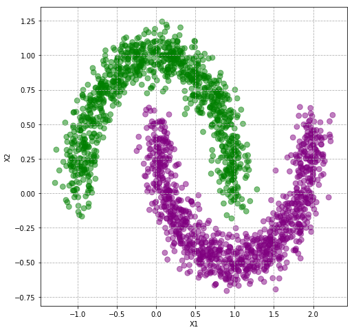


```python
xtrain, xtest, ytrain, ytest = train_test_split(x, y)
```


```python
clf = SVC(kernel='sigmoid')
clf.fit(xtrain, ytrain)
ytrain_pred = clf.predict(xtrain)
ytest_pred = clf.predict(xtest)
plot_svm_groups(x, y, clf)
print_report(ytrain, ytest, ytrain_pred, ytest_pred)
```


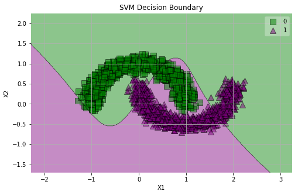


    Train Scores
    --------------------------------------------------
                  precision    recall  f1-score   support
    
               0       0.64      0.64      0.64       749
               1       0.64      0.64      0.64       751
    
        accuracy                           0.64      1500
       macro avg       0.64      0.64      0.64      1500
    weighted avg       0.64      0.64      0.64      1500
    
    Train Accuracy: 0.6406666666666667
    Test Scores
    --------------------------------------------------
                  precision    recall  f1-score   support
    
               0       0.63      0.67      0.65       251
               1       0.64      0.60      0.62       249
    
        accuracy                           0.64       500
       macro avg       0.64      0.64      0.64       500
    weighted avg       0.64      0.64      0.64       500
    
    Test Accuracy: 0.636


### RBF


```python
clf = SVC(kernel='rbf')
clf.fit(xtrain, ytrain)
ytrain_pred = clf.predict(xtrain)
ytest_pred = clf.predict(xtest)
plot_svm_groups(x, y, clf)
print_report(ytrain, ytest, ytrain_pred, ytest_pred)
```


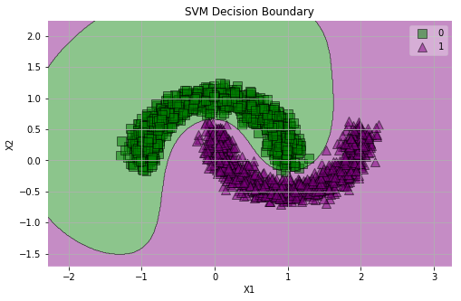


    Train Scores
    --------------------------------------------------
                  precision    recall  f1-score   support
    
               0       1.00      1.00      1.00       749
               1       1.00      1.00      1.00       751
    
        accuracy                           1.00      1500
       macro avg       1.00      1.00      1.00      1500
    weighted avg       1.00      1.00      1.00      1500
    
    Train Accuracy: 0.9993333333333333
    Test Scores
    --------------------------------------------------
                  precision    recall  f1-score   support
    
               0       1.00      1.00      1.00       251
               1       1.00      1.00      1.00       249
    
        accuracy                           1.00       500
       macro avg       1.00      1.00      1.00       500
    weighted avg       1.00      1.00      1.00       500
    
    Test Accuracy: 1.0


### Linear


```python
clf = LinearSVC()
clf.fit(xtrain, ytrain)
ytrain_pred = clf.predict(xtrain)
ytest_pred = clf.predict(xtest)
plot_svm_groups(x, y, clf)
print_report(ytrain, ytest, ytrain_pred, ytest_pred)
```


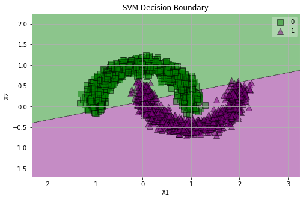


    Train Scores
    --------------------------------------------------
                  precision    recall  f1-score   support
    
               0       0.88      0.88      0.88       749
               1       0.88      0.88      0.88       751
    
        accuracy                           0.88      1500
       macro avg       0.88      0.88      0.88      1500
    weighted avg       0.88      0.88      0.88      1500
    
    Train Accuracy: 0.8833333333333333
    Test Scores
    --------------------------------------------------
                  precision    recall  f1-score   support
    
               0       0.86      0.84      0.85       251
               1       0.85      0.86      0.85       249
    
        accuracy                           0.85       500
       macro avg       0.85      0.85      0.85       500
    weighted avg       0.85      0.85      0.85       500
    
    Test Accuracy: 0.852


## Polynomial SVM


```python
clf = SVC(kernel='poly', degree=3, gamma='auto')
clf.fit(xtrain, ytrain)
ytrain_pred = clf.predict(xtrain)
ytest_pred = clf.predict(xtest)
plot_svm_groups(x, y, clf)
print_report(ytrain, ytest, ytrain_pred, ytest_pred)
```


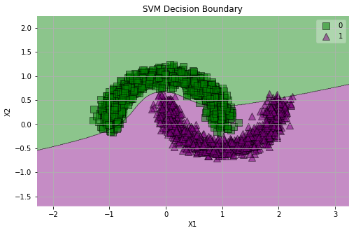


    Train Scores
    --------------------------------------------------
                  precision    recall  f1-score   support
    
               0       0.99      0.88      0.93       749
               1       0.89      0.99      0.94       751
    
        accuracy                           0.93      1500
       macro avg       0.94      0.93      0.93      1500
    weighted avg       0.94      0.93      0.93      1500
    
    Train Accuracy: 0.9333333333333333
    Test Scores
    --------------------------------------------------
                  precision    recall  f1-score   support
    
               0       1.00      0.84      0.91       251
               1       0.86      1.00      0.92       249
    
        accuracy                           0.92       500
       macro avg       0.93      0.92      0.92       500
    weighted avg       0.93      0.92      0.92       500
    
    Test Accuracy: 0.916


###  Thoughts?


```python
x, y = make_blobs(n_samples=3000, n_features=2, centers=3, cluster_std=1.8)
plot_groups3(x, y)
```


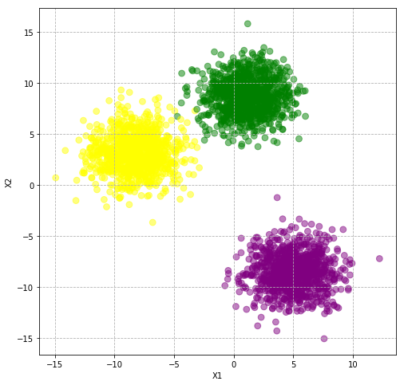


## Let's try all types of SVMs


```python
xtrain, xtest, ytrain, ytest = train_test_split(x, y)
```

### Linear


```python
for degree in range(1, 10):
    print(f"degree = {degree}")
    print("-"*50)
    clf = SVC(kernel='poly', degree=degree)
    clf.fit(xtrain, ytrain)
    ytrain_pred = clf.predict(xtrain)
    ytest_pred = clf.predict(xtest)
    plot_svm_groups(x, y, clf)
    print_report(ytrain, ytest, ytrain_pred, ytest_pred)
    print("\n\n")
```

    degree = 1
    --------------------------------------------------


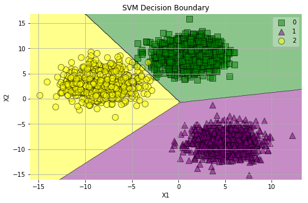


    Train Scores
    --------------------------------------------------
                  precision    recall  f1-score   support
    
               0       1.00      1.00      1.00       760
               1       1.00      1.00      1.00       739
               2       1.00      1.00      1.00       751
    
        accuracy                           1.00      2250
       macro avg       1.00      1.00      1.00      2250
    weighted avg       1.00      1.00      1.00      2250
    
    Train Accuracy: 0.9991111111111111
    Test Scores
    --------------------------------------------------
                  precision    recall  f1-score   support
    
               0       1.00      1.00      1.00       240
               1       1.00      1.00      1.00       261
               2       1.00      1.00      1.00       249
    
        accuracy                           1.00       750
       macro avg       1.00      1.00      1.00       750
    weighted avg       1.00      1.00      1.00       750
    
    Test Accuracy: 1.0
    
    
    
    degree = 2
    --------------------------------------------------


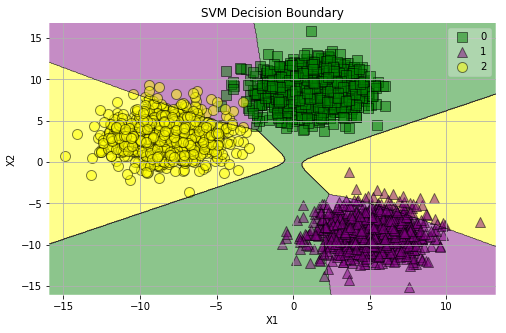


    Train Scores
    --------------------------------------------------
                  precision    recall  f1-score   support
    
               0       0.94      0.96      0.95       760
               1       0.92      0.90      0.91       739
               2       0.96      0.96      0.96       751
    
        accuracy                           0.94      2250
       macro avg       0.94      0.94      0.94      2250
    weighted avg       0.94      0.94      0.94      2250
    
    Train Accuracy: 0.9404444444444444
    Test Scores
    --------------------------------------------------
                  precision    recall  f1-score   support
    
               0       0.94      0.95      0.95       240
               1       0.93      0.89      0.91       261
               2       0.94      0.97      0.96       249
    
        accuracy                           0.94       750
       macro avg       0.94      0.94      0.94       750
    weighted avg       0.94      0.94      0.94       750
    
    Test Accuracy: 0.9373333333333334
    
    
    
    degree = 3
    --------------------------------------------------


    Train Scores
    --------------------------------------------------
                  precision    recall  f1-score   support
    
               0       1.00      1.00      1.00       760
               1       1.00      1.00      1.00       739
               2       1.00      1.00      1.00       751
    
        accuracy                           1.00      2250
       macro avg       1.00      1.00      1.00      2250
    weighted avg       1.00      1.00      1.00      2250
    
    Train Accuracy: 0.9991111111111111
    Test Scores
    --------------------------------------------------
                  precision    recall  f1-score   support
    
               0       1.00      1.00      1.00       240
               1       1.00      1.00      1.00       261
               2       1.00      1.00      1.00       249
    
        accuracy                           1.00       750
       macro avg       1.00      1.00      1.00       750
    weighted avg       1.00      1.00      1.00       750
    
    Test Accuracy: 0.9986666666666667
    
    
    
    degree = 4
    --------------------------------------------------


    Train Scores
    --------------------------------------------------
                  precision    recall  f1-score   support
    
               0       0.93      0.96      0.95       760
               1       0.93      0.87      0.90       739
               2       0.95      0.97      0.96       751
    
        accuracy                           0.93      2250
       macro avg       0.93      0.93      0.93      2250
    weighted avg       0.93      0.93      0.93      2250
    
    Train Accuracy: 0.9337777777777778
    Test Scores
    --------------------------------------------------
                  precision    recall  f1-score   support
    
               0       0.93      0.97      0.95       240
               1       0.95      0.85      0.90       261
               2       0.92      0.98      0.95       249
    
        accuracy                           0.93       750
       macro avg       0.93      0.94      0.93       750
    weighted avg       0.93      0.93      0.93       750
    
    Test Accuracy: 0.9333333333333333
    
    
    
    degree = 5
    --------------------------------------------------


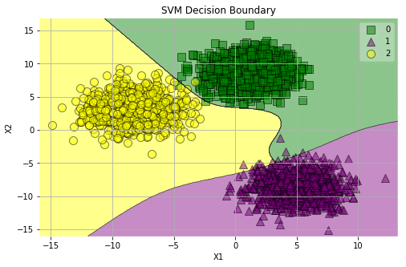


    Train Scores
    --------------------------------------------------
                  precision    recall  f1-score   support
    
               0       1.00      1.00      1.00       760
               1       1.00      0.99      0.99       739
               2       0.99      1.00      0.99       751
    
        accuracy                           1.00      2250
       macro avg       1.00      1.00      1.00      2250
    weighted avg       1.00      1.00      1.00      2250
    
    Train Accuracy: 0.9951111111111111
    Test Scores
    --------------------------------------------------
                  precision    recall  f1-score   support
    
               0       0.98      1.00      0.99       240
               1       1.00      0.98      0.99       261
               2       1.00      1.00      1.00       249
    
        accuracy                           0.99       750
       macro avg       0.99      0.99      0.99       750
    weighted avg       0.99      0.99      0.99       750
    
    Test Accuracy: 0.9946666666666667
    
    
    
    degree = 6
    --------------------------------------------------


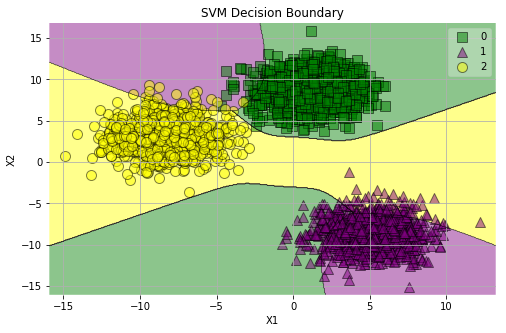


    Train Scores
    --------------------------------------------------
                  precision    recall  f1-score   support
    
               0       0.91      0.97      0.94       760
               1       0.94      0.82      0.88       739
               2       0.93      0.97      0.95       751
    
        accuracy                           0.92      2250
       macro avg       0.93      0.92      0.92      2250
    weighted avg       0.92      0.92      0.92      2250
    
    Train Accuracy: 0.924
    Test Scores
    --------------------------------------------------
                  precision    recall  f1-score   support
    
               0       0.90      0.98      0.94       240
               1       0.96      0.81      0.88       261
               2       0.91      0.98      0.94       249
    
        accuracy                           0.92       750
       macro avg       0.92      0.92      0.92       750
    weighted avg       0.92      0.92      0.92       750
    
    Test Accuracy: 0.9213333333333333
    
    
    
    degree = 7
    --------------------------------------------------


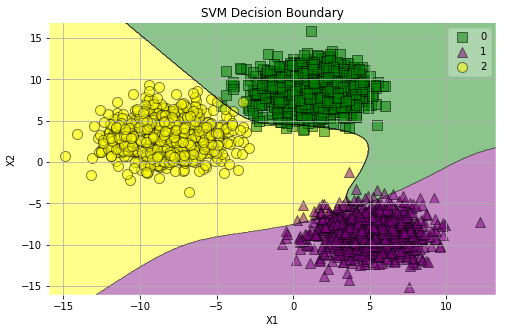


    Train Scores
    --------------------------------------------------
                  precision    recall  f1-score   support
    
               0       0.99      0.99      0.99       760
               1       1.00      0.96      0.98       739
               2       0.97      1.00      0.98       751
    
        accuracy                           0.98      2250
       macro avg       0.98      0.98      0.98      2250
    weighted avg       0.98      0.98      0.98      2250
    
    Train Accuracy: 0.984
    Test Scores
    --------------------------------------------------
                  precision    recall  f1-score   support
    
               0       0.99      0.99      0.99       240
               1       1.00      0.95      0.98       261
               2       0.96      1.00      0.98       249
    
        accuracy                           0.98       750
       macro avg       0.98      0.98      0.98       750
    weighted avg       0.98      0.98      0.98       750
    
    Test Accuracy: 0.9813333333333333
    
    
    
    degree = 8
    --------------------------------------------------


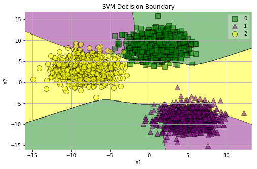


    Train Scores
    --------------------------------------------------
                  precision    recall  f1-score   support
    
               0       0.89      0.96      0.92       760
               1       0.95      0.77      0.85       739
               2       0.88      0.98      0.93       751
    
        accuracy                           0.90      2250
       macro avg       0.91      0.90      0.90      2250
    weighted avg       0.91      0.90      0.90      2250
    
    Train Accuracy: 0.9017777777777778
    Test Scores
    --------------------------------------------------
                  precision    recall  f1-score   support
    
               0       0.89      0.97      0.93       240
               1       0.98      0.75      0.85       261
               2       0.85      0.99      0.92       249
    
        accuracy                           0.90       750
       macro avg       0.91      0.90      0.90       750
    weighted avg       0.91      0.90      0.90       750
    
    Test Accuracy: 0.9013333333333333
    
    
    
    degree = 9
    --------------------------------------------------


    Train Scores
    --------------------------------------------------
                  precision    recall  f1-score   support
    
               0       0.98      0.99      0.99       760
               1       1.00      0.94      0.97       739
               2       0.96      1.00      0.98       751
    
        accuracy                           0.98      2250
       macro avg       0.98      0.98      0.98      2250
    weighted avg       0.98      0.98      0.98      2250
    
    Train Accuracy: 0.9777777777777777
    Test Scores
    --------------------------------------------------
                  precision    recall  f1-score   support
    
               0       0.96      0.99      0.98       240
               1       1.00      0.92      0.96       261
               2       0.95      1.00      0.97       249
    
        accuracy                           0.97       750
       macro avg       0.97      0.97      0.97       750
    weighted avg       0.97      0.97      0.97       750
    
    Test Accuracy: 0.9693333333333334
    
    
    


### Polynomial (3)


```python
clf = SVC(kernel='poly', degree=3)
clf.fit(xtrain, ytrain)
ytrain_pred = clf.predict(xtrain)
ytest_pred = clf.predict(xtest)
plot_svm_groups(x, y, clf)
print_report(ytrain, ytest, ytrain_pred, ytest_pred)
```


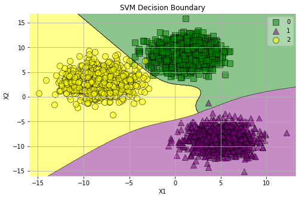


    Train Scores
    --------------------------------------------------
                  precision    recall  f1-score   support
    
               0       1.00      1.00      1.00       760
               1       1.00      1.00      1.00       739
               2       1.00      1.00      1.00       751
    
        accuracy                           1.00      2250
       macro avg       1.00      1.00      1.00      2250
    weighted avg       1.00      1.00      1.00      2250
    
    Train Accuracy: 0.9991111111111111
    Test Scores
    --------------------------------------------------
                  precision    recall  f1-score   support
    
               0       1.00      1.00      1.00       240
               1       1.00      1.00      1.00       261
               2       1.00      1.00      1.00       249
    
        accuracy                           1.00       750
       macro avg       1.00      1.00      1.00       750
    weighted avg       1.00      1.00      1.00       750
    
    Test Accuracy: 0.9986666666666667


### RBF


```python
clf = SVC(kernel='rbf')
clf.fit(xtrain, ytrain)
ytrain_pred = clf.predict(xtrain)
ytest_pred = clf.predict(xtest)
plot_svm_groups(x, y, clf)
print_report(ytrain, ytest, ytrain_pred, ytest_pred)
```


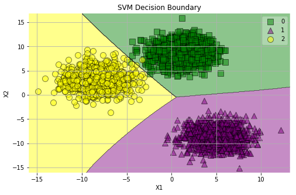


    Train Scores
    --------------------------------------------------
                  precision    recall  f1-score   support
    
               0       1.00      1.00      1.00       760
               1       1.00      1.00      1.00       739
               2       1.00      1.00      1.00       751
    
        accuracy                           1.00      2250
       macro avg       1.00      1.00      1.00      2250
    weighted avg       1.00      1.00      1.00      2250
    
    Train Accuracy: 0.9991111111111111
    Test Scores
    --------------------------------------------------
                  precision    recall  f1-score   support
    
               0       1.00      1.00      1.00       240
               1       1.00      1.00      1.00       261
               2       1.00      1.00      1.00       249
    
        accuracy                           1.00       750
       macro avg       1.00      1.00      1.00       750
    weighted avg       1.00      1.00      1.00       750
    
    Test Accuracy: 1.0


### Sigmoidal


```python
clf = SVC(kernel='sigmoid')
clf.fit(xtrain, ytrain)
ytrain_pred = clf.predict(xtrain)
ytest_pred = clf.predict(xtest)
plot_svm_groups(x, y, clf)
print_report(ytrain, ytest, ytrain_pred, ytest_pred)
```


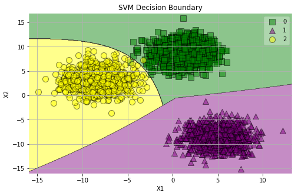


    Train Scores
    --------------------------------------------------
                  precision    recall  f1-score   support
    
               0       1.00      1.00      1.00       760
               1       1.00      1.00      1.00       739
               2       1.00      1.00      1.00       751
    
        accuracy                           1.00      2250
       macro avg       1.00      1.00      1.00      2250
    weighted avg       1.00      1.00      1.00      2250
    
    Train Accuracy: 0.9991111111111111
    Test Scores
    --------------------------------------------------
                  precision    recall  f1-score   support
    
               0       1.00      1.00      1.00       240
               1       1.00      1.00      1.00       261
               2       1.00      1.00      1.00       249
    
        accuracy                           1.00       750
       macro avg       1.00      1.00      1.00       750
    weighted avg       1.00      1.00      1.00       750
    
    Test Accuracy: 1.0


### Assessment
